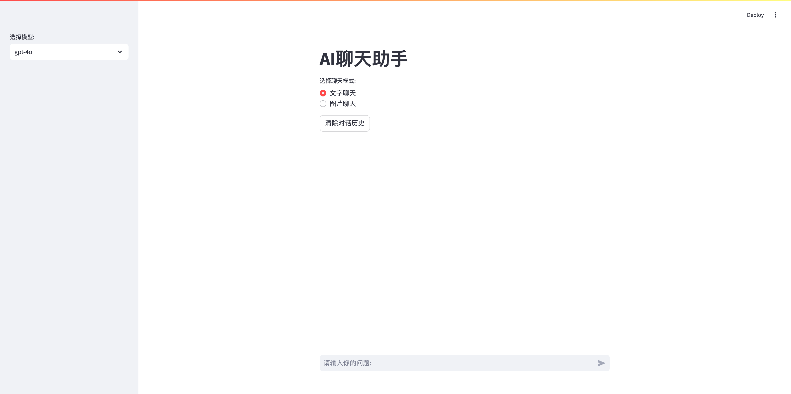

# LocalAI based on Github Models

[](https://share.streamlit.io/huangdijia/local-ai/app.py)



## Introduction

This project is a simple implementation of a local AI model based on Github models. The idea is to use the Github API to search for a model and download it to the local machine. The model can then be used for inference on local data.

## Installation

To install the project, you can clone the repository and install the dependencies using the following commands:

```bash
git clone https://github.com/huangdijia/local-ai.git
cd local-ai
pip install -r requirements.txt
```

## Configuration

To use the Github API, you need to create a personal access token. You can do this by following the instructions [here](https://docs.github.com/en/github/authenticating-to-github/creating-a-personal-access-token).

Once you have created the token, you can export it as an environment variable:

```bash
export GITHUB_TOKEN=your_github_token_here
```

## Usage

To use the project, you can run the following command:

```bash
streamlit run app.py
```

This will start a Streamlit application where you can search for a model and download it to the local machine. The model can then be used for inference on local data.

Visit [http://localhost:8501](http://localhost:8501) to view the app.

## Run in venv

```bash
git clone https://github.com/huangdijia/local-ai.git
cd local-ai
python3 -m venv venv
source venv/bin/activate
pip install -r requirements.txt
streamlit run app.py
```

## License

This project is licensed under the MIT License - see the [LICENSE](LICENSE) file for details.
```
